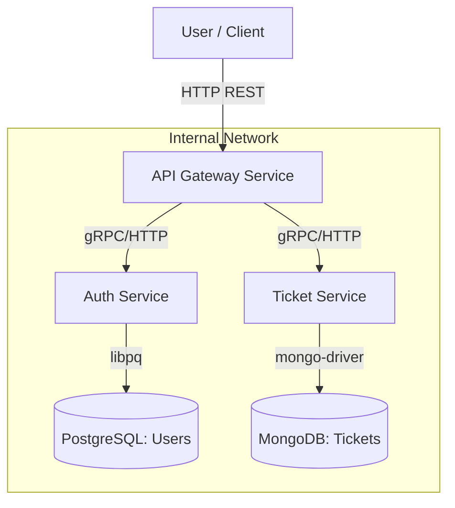

# Implementation Plan - Ticket Microservices (Oat++)

## Goal Description
Build a robust microservices system for selling tickets using **C++** and **Oat++**.
The system will consist of an API Gateway, an Authentication Service, and a Ticket Management Service.
We focus on "Deep Understanding" of how these components talk to each other (HTTP & gRPC), how they store data safely, and how we deploy them.

## User Review Required
> [!IMPORTANT]
> **Monorepo Strategy**: I propose keeping all services in one repository (Monorepo) initially. This makes code sharing (DTOs, Utils) helper, and debugging easier. We can split them later if needed.

## Architecture Overview

### High Level Design

### Technology Stack
*   **Web Framework**: `Oat++` (oatpp)
    *   *Why*: Pure C++, clean codebase, reflection-based DTOs (very convenient), modular.
*   **Inter-service Communication**: `gRPC` + `Protobuf`
    *   *Why*: Efficient, strictly typed contracts between services.
*   **Database**:
    *   **PostgreSQL** (via `oatpp-postgresql` or `libpq`) for Users/Transactions (ACID required).
    *   **MongoDB** (via `oatpp-mongo` or `mongo-cxx`) for Tickets/Events (Flexible schema).
*   **Authentication**: JWT (JSON Web Tokens).

## Proposed Changes (Skeleton Phase)

### [Root]
Setup the main CMake project to manage sub-service builds.

#### [NEW] [CMakeLists.txt](file:///home/artm1904/Program/c++/project/network/ticket_sell_microservice/CMakeLists.txt)
*   Root project definition.
*   Add subdirectories: `gateway`, `auth_service`, `ticket_service`, `shared`.

### [Shared]
Library containing code used by all services.

#### [NEW] [DTOs & Utils]
*   **`shared/dto`**: Oat++ DTOs for common responses (ErrorResponse, etc.).
*   **`shared/proto`**: `.proto` files defining gRPC interfaces.

### [Auth Service]
The authority on user identity.

*   **Endpoint**: `/auth/login`, `/auth/register`.
*   **DB**: Stores user hashes.

### [Gateway]
The transparent proxy + Guard.

*   **Middleware**: Validates JWT signature. If valid, forwards request.
*   **Routing**: `/api/v1/tickets` -> TicketService.

## Educational Goals (Deep Dive)
In each component, we will focus on specific concepts:
1.  **Gateway**: Asynchronous forwarding, Load Balancing concepts (simple round-robin later).
2.  **Auth**: Security best practices (Salting passwords, JWT signing algorithms).
3.  **Tickets**: Data consistency, storage patterns.

## Verification Plan

### Manual Verification
1.  **Build**: Ensure `cmake` compiles without errors.
2.  **Run**: Start services via Docker Compose (or locally).
3.  **Test**: `curl` to Gateway should be routed effectively.